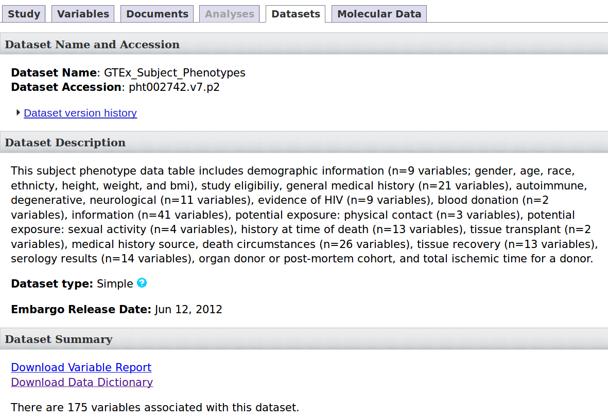
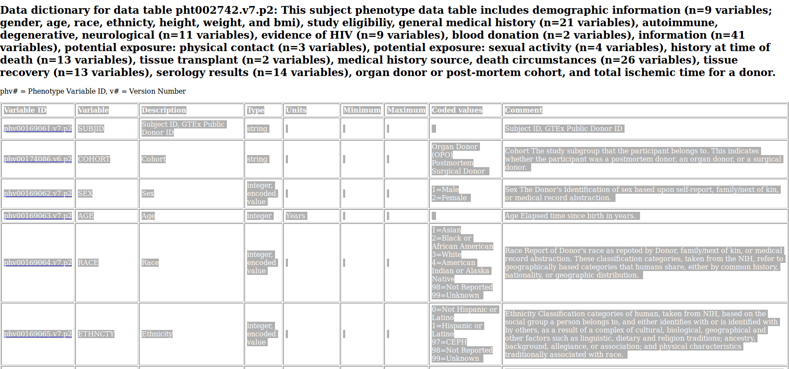

# PlanX-Bioinfo-Tools:

`dbgap_convert_dict.py`:

## Creating Input Files

1. Go to the dbGaP study page. Following the example data, visit the dbGaP page for Accession [phs000424](https://www.ncbi.nlm.nih.gov/projects/gap/cgi-bin/study.cgi?study_id=phs000424.v7.p2).

2. Click on the Datasets tab.

[](dbGaP_Dataset_Data_Dictionary.png "Click to see the full image.")

3. Click on the 'Download Data Dictionary'.


4. On the new page, select the table, copy and paste it into an excel file.

[](dbGaP_select_table.png "Click to see the full image.")

5. Save this excel file as a tsv.


6. Run the following code to save the output:

```
python2.7 dbgap_convert_dict.py --dictionary input.tsv > output.tsv
```

7. Manual curation of the output.tsv file will be necessary to coerce the dbGaP information into the desired Data Dictionary. To do this, a column for `Node`, `Variable` and `Type` will need to be addded to the output.tsv file. The `Node` column refers to the `Node` in the Data Dictionary. The `Variable` column refers to the `Property` in the `Node` for the Data Dictionary. If a `Variable` is not being used, write `NA` to skip this entry. The `Type` column will be either, `Add enum`, `New`, or `Delete`, and this column refers to whether this will be added to the Data Dictionary. This manual curation will require a good understanding of the Data Dictionary, as it is the users responsibilty to determine what fields belong under which property.

8. Using this output.tsv file, go to the `Dictionary Tools` and use this file as the `Variable.tsv` input file to modify the Data Dictionary.

9. After the modifications have been made to the dictionary, remove the `Type` column to use this output.tsv file with the `dbgap_to_gen3.py` tool.

10. Run the `dbgap_to_gen3.py` tool to upload the edits to the dictionary. For information on using that tool, see the README.md or use the --help flag.
