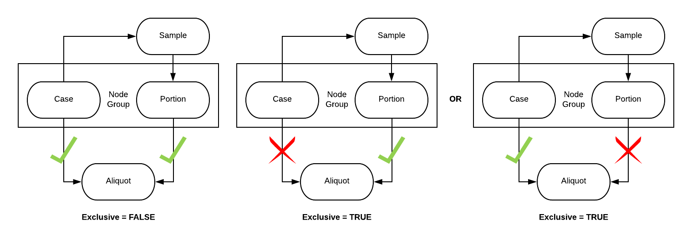

# PlanX-Bioinfo-Tools:

`Modify.py`:

## Creating Input Files

### nodes.tsv (input):

* __<node\>:__ The name of the node, this can be either a new or existing node in the dictionary.
* __<node_action\>:__ The action to be completed by `Modify.py`. This can be to either add, update, delete the node.
* __<title\>:__  Title of the node, the front facing name.
* __<category\>:__ The name for the group of nodes, these are usually nodes that have a common concept like: Administrative, Index File, Biospecimen, Clinical, Data File and Notation.
* __<description\>:__ The detailed characterization of the node.
* __<link_name\>:__ The name of the parent node the focal node will link to. This will use the backref version of the parent node name. **(Supports node groups)**
* __<backref\>:__ The name of the focal node as it would be referenced by a linked child node.
* __<label\>:__ The written label for the connection between nodes. This string should be descriptive for how the two nodes interact with each other like: linked_to, performed_on, performed_at, or associated_with. **(Supports node groups)**
* __<target\>:__ This name of the node that the active node will link to. This will often be the node name of the <link_name\>, not the <backref\> version. **(Supports node groups)**
* __<multiplicity\>:__ The number of connections that can be made between the two nodes. The different types of connections can be: many_to_many, many_to_one, one_to_many, or one_to_one. **(Supports node groups)**
* __<link_required\>:__ A boolean response (`TRUE`/`FALSE`) as to whether the link is required between nodes. **(Supports node groups)**
* __<link_group_required\>:__ A boolean response (`TRUE`/`FALSE`) that will determine if any of the nodes within the group is required to link to the focal node being modified or added.
* __<group_exclusive\>:__ A boolean response (`TRUE`/`FALSE`) that will determine if the group will exclude any other node connections. This is demonstrated in the following graph:

[](Node_Group.png "Click to see the full image.")

#### Node Groups

When the focal node interacts with multiple parent nodes, these parents nodes will be treated as a node group. This is indicated in the node file with the node group being represented as a list within brackets, "[ ]", such as [NodeA, NodeB, ...]. For fields that support node groups, values within the brackets will need to be given in the same order as the nodes within the group.

The fields of <link_required\>, <link_group_required\>, and <group_exclusive\> interact with each other and can create false configurations if not properly set up. Here are a few examples of what does and does not work:

__Example 1:__
```
`link_name`:[NodeA, NodeB]
`link_required`: [TRUE, FALSE]
`link_group_required`: TRUE
`group_exclusive`: TRUE
```
The setup in Example 1 does __NOT__ work because NodeA is always required and due to exclusitivity, NodeB could never be linked to.

__Example 2:__
```
`link_name`:[NodeA, NodeB]
`link_required`: [TRUE, FALSE]
`link_group_required`: TRUE
`group_exclusive`: FALSE
```

The setup in Example 2 does work as NodeA will always be required, but NodeB can still be linked as the group is not exclusive.

__Example 3:__
```
`link_name`:[NodeA, NodeB]
`link_required`: [FALSE, FALSE]
`link_group_required`: TRUE
`group_exclusive`: TRUE
```

The setup in Example 3 is the most common case, where a link is required from one of the two nodes in the node group, NodeA or NodeB, and only one of the nodes can link to the focal node.

### variables.tsv (input):

* __<node\>:__ The name of the focal node that will contain the modified variables.
* __<field_action\>:__ This will tell the program that the variable in the node is either being added, deleted, or updated.
* __<field\>:__ The name of the field in the focal node.
* __<description\>:__ The description of the field.
* __<type\>:__ The class of expected value for the field. The classes can be values like, integer, string, enum, and boolean.
* __<options_action\>:__ When updating a field that has enumerations, this value tells the program whether the user will add, delete or replace a list of enumerations. Replace will remove the entire existing list with the new list provided.
* __<options\>:__ The list of enumerations that will either be replaced, deleted or added.
* __<required\>:__ A boolean response (`TRUE`/`FALSE`) as to whether this field is required in the focal node.
* __<term\>:__ This value will point the term.yaml file and the name of the property. This will help reduce the amount of redundancy within the data dictionary.